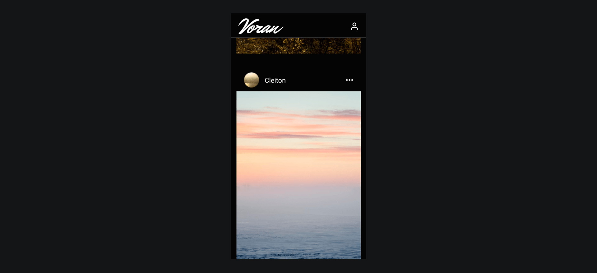

# Voran

Rede social onde usuários podem enviar, visualizar, comentar fotos.

Projeto da disciplina de Programação para Dispositivos Móveis




## 💻 Requerimentos

- [Node](https://nodejs.org/)
- [Yarn](https://yarnpkg.com/)
- [Expo](https://expo.dev/)

## 🚀 Instalação

Clone o repositório:

```Shell
git clone https://github.com/Lucas8x/proj-mobile.git
```

Entre na pasta:

```Shell
cd proj-mobile
```

Instale as dependências:

```Shell
yarn install
```

Incie o projeto:

```Shell
expo start
```

## ⚙️ Configurações

```js
// src/config/firebase.config.ts
apiKey: '',
authDomain: '',
projectId: '',
storageBucket: '',
messagingSenderId: '',
appId: '',
```

## 📝 Licença

Este projeto esta sob a licença [MIT](./LICENSE).
